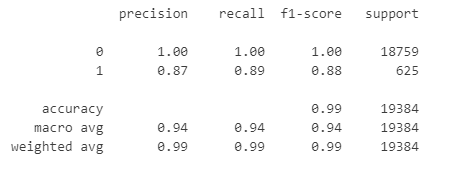

# Credit Risk Classification
### Contributor: Lan "Alice" Nguyen

### Overview
This project focuses on analyzing loan data with the objective of employing a Supervised Machine Learning model to predict high-risk loans. Information such as loan size, interest rate, and loaner income was utilized to train a Logistic Regression model for assessing the risk level of loans. The risk levels are categorized as 0 (healthy loan) and 1 (high-risk loan). It's worth noting that the dataset is imbalanced, with 75,036 healthy loans compared to 2,500 high-risk loans. The primary goal is to identify high-risk loans within a predominantly healthy loan dataset.

### The results
Here is the classification report for the Logistic Regression model:

- The overall accuracy of the model is 99%. The model excels in predicting the `0` label (healthy loan), achieving nearly 100% accuracy, while its accuracy for the `1` label (high-risk) is lower at 88%.
- The precision score for healthy loans is close to 100%, indicating that the model is almost perfect at identifying healthy loans. The precision score for high-risk loans is 87%, meaning that out of all the predicted high-risk loans, 87% of them are genuinely high-risk.
- The recall score for healthy loans is, once again, 100%, indicating that the model perfectly predicts healthy loans. The recall score for high-risk loans is 89%, signifying that out of all the actually high-risk loans, the model successfully identifies 89% of them as high-risk.

### Summary
The Logistic Regression model excels in predicting the `0` label (healthy loan), achieving nearly 100% accuracy, while its accuracy for the `1` label (high-risk) is 88%. However, it's important to note that the dataset is imbalanced, with 75036 instances of `0` and only 2500 instances of `1`. Therefore, the 100% accuracy in predicting '0' can be meaningless. The primary emphasis of the model is on identifying high-risk loans (label `1`), where it demonstrates a commendable 88% accuracy. Given this performance, I find the model suitable for future projects.
